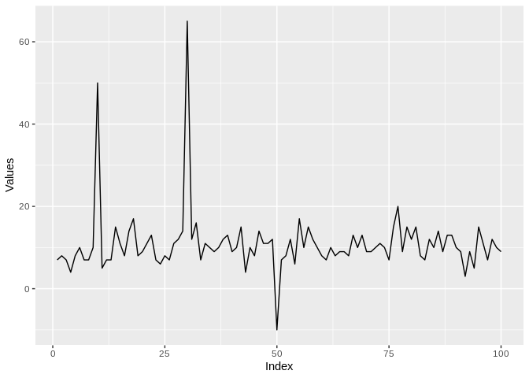
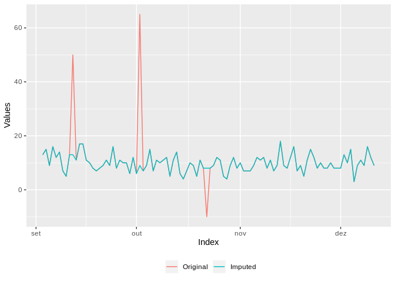

DDME - Repositório de funções do R úteis para o dia a dia
=========================================================

1 inspeciona\_outlier()
-----------------------

Função base criada por Gabriel Motta, útil para detecção de outliers em séries temporais com base no pacote `anomalize`. As opções de uso são:

-   Atômicos:
    -   vetor com inteiros ou numéricos
    -   objeto ts
-   Tabelas:
    -   data.table
    -   tbl\_df
    -   data.frame

### Exemplo série unidimensional

Vetor sem data guardado em `x`:



O resultado da chamada é um objeto `data.table`. Note que a coluna `DATA` é criada arbitrariamente e nem faz sentido, já que o objeto inicial não possui referências temporais.

``` r
x_alterado <- inspeciona_outlier(x)
x_alterado[49:55]
```

    ##        DATA SERIE SERIE_IMPUTADA FLAG_OUTLIER
    ## 1: 49-01-01    12             12            0
    ## 2: 50-01-01   -10             11            1
    ## 3: 51-01-01    12             12            0
    ## 4: 52-01-01     9              9            0
    ## 5: 53-01-01    10             10            0
    ## 6: 54-01-01    10             10            0
    ## 7: 55-01-01    11             11            0

``` r
x_alterado %>% 
  melt(id = "DATA", measure = patterns("SERIE")) %>% 
  dplyr::mutate(variable = factor(variable, labels = c("Original","Imputada"))) %>% {.[]} %>% 
  ggplot(aes(DATA,value,color = variable)) +
  geom_line() +
  labs(x = "Índice", y = "Valores", color = "") + 
  theme(legend.position = "bottom")
```



### Múltiplas séries

O sentido das séries na tabela que estiver trabalhando pode ser por linhas ou colunas, e essencialmente este é o único cuidado que se deve ter para a chamada da função. O argumento `sentido` deve ser definido como **1 para linhas** ou **2 para colunas**.

#### Séries nas linhas

Exemplo para tabelas com séries nas linhas:

``` r
d1[,1:10]
```

    ##    ID      V1      V2      V3       V4       V5       V6       V7       V8
    ## 1:  1 16.0000 11.0000 10.0000 8.000000 9.000000 12.00000 9.000000 11.00000
    ## 2:  2 15.6993 11.3389 11.4841 8.593408 9.579619 10.32584 8.899792 11.96684
    ##          V9
    ## 1: 2.000000
    ## 2: 2.148456

``` r
# Formato de saída "wide"
inspeciona_outlier(d1, sentido = 1) %>% 
  dplyr::sample_n(10) %>% 
  {.[order(ID,PERIODO)]}
```

    ##     ID PERIODO     SERIE SERIE_IMPUTADA FLAG_OUTLIER
    ##  1:  1     V16  6.000000       6.000000            0
    ##  2:  1     V17 11.000000      11.000000            0
    ##  3:  1     V40  5.000000      11.000000            1
    ##  4:  1     V63  5.000000       5.000000            0
    ##  5:  1     V66 15.000000      15.000000            0
    ##  6:  2     V11  9.000303       9.000303            0
    ##  7:  2     V68  7.763033       7.763033            0
    ##  8:  2     V69  5.531005       5.531005            0
    ##  9:  2     V74  9.669374       9.669374            0
    ## 10:  2     V95  8.145249       8.145249            0

``` r
# Formato de saída "long"
inspeciona_outlier(d1, sentido = 1, out_format = "long") %>% 
  dplyr::sample_n(10) %>% 
  {.[order(ID,PERIODO)]}
```

    ##     ID PERIODO FLAG_OUTLIER IMPUTADA     VALOR
    ##  1:  1     V12            0        0  8.000000
    ##  2:  1     V27            0        1  7.000000
    ##  3:  1     V41            0        0 11.000000
    ##  4:  1      V5            0        0  9.000000
    ##  5:  1     V70            0        1 14.000000
    ##  6:  1     V85            0        1 10.000000
    ##  7:  2     V10            1        0 49.646305
    ##  8:  2    V100            0        1 12.555860
    ##  9:  2     V38            0        0  6.668038
    ## 10:  2     V82            0        1 13.603500

#### Séries nas colunas

Exemplo para tableas com séries nas colunas:

``` r
d2[1:5]
```

    ##          DATA SERIE1   SERIE2
    ## 1: 2018-01-01     16  -0.0332
    ## 2: 2018-01-02     11 -28.3779
    ## 3: 2018-01-03     10  -2.1060
    ## 4: 2018-01-04      8  -3.4990
    ## 5: 2018-01-05      9   0.6313

``` r
# Formato de saída "wide"
inspeciona_outlier(d2, sentido = 2) %>% head()
```

    ##          DATA SERIE1 SERIE1_IMPUTADA SERIE1_FLAG_OUTLIER   SERIE2
    ## 1: 2018-01-01     16              16                   0  -0.0332
    ## 2: 2018-01-02     11              11                   0 -28.3779
    ## 3: 2018-01-03     10              10                   0  -2.1060
    ## 4: 2018-01-04      8               8                   0  -3.4990
    ## 5: 2018-01-05      9               9                   0   0.6313
    ## 6: 2018-01-06     12              12                   0  -0.3722
    ##    SERIE2_IMPUTADA SERIE2_FLAG_OUTLIER
    ## 1:         -0.0332                   0
    ## 2:         -2.1060                   1
    ## 3:         -2.1060                   0
    ## 4:         -3.4990                   0
    ## 5:          0.6313                   0
    ## 6:         -0.3722                   0

``` r
# Formato de saída "long"
inspeciona_outlier(d2, sentido = 2, out_format = "long") %>% 
  dplyr::sample_n(10) %>% 
  {.[order(SERIE,DATA)]}
```

    ##           DATA  SERIE FLAG_OUTLIER IMPUTADA   VALOR
    ##  1: 2018-01-05 SERIE1            0        1  9.0000
    ##  2: 2018-01-13 SERIE1            0        0 10.0000
    ##  3: 2018-02-08 SERIE1            0        1 11.0000
    ##  4: 2018-02-23 SERIE1            0        0 10.0000
    ##  5: 2018-04-09 SERIE1            0        0 10.0000
    ##  6: 2018-01-22 SERIE2            0        0  1.1284
    ##  7: 2018-01-23 SERIE2            1        1  0.4391
    ##  8: 2018-02-08 SERIE2            0        1 -1.0719
    ##  9: 2018-03-21 SERIE2            0        1  0.0608
    ## 10: 2018-03-27 SERIE2            0        1  0.6664

2 na\_prop()
------------

Função para checar proporção de valores faltantes num `data.table` com variáveis nas colunas.

### Exemplo para banco de dados `airquality`

``` r
dados <- airquality %>% as.data.table()
head(dados)
```

    ##    Ozone Solar.R Wind Temp Month Day
    ## 1:    41     190  7.4   67     5   1
    ## 2:    36     118  8.0   72     5   2
    ## 3:    12     149 12.6   74     5   3
    ## 4:    18     313 11.5   62     5   4
    ## 5:    NA      NA 14.3   56     5   5
    ## 6:    28      NA 14.9   66     5   6

``` r
# Geral
dados %>% na_prop()
```

    ##    VARIAVEL N_MISSING N_TOTAL PROPORCAO_NA
    ## 1:    Ozone        37     153   0.24183007
    ## 2:  Solar.R         7     153   0.04575163
    ## 3:     Wind         0     153   0.00000000
    ## 4:     Temp         0     153   0.00000000
    ## 5:    Month         0     153   0.00000000
    ## 6:      Day         0     153   0.00000000

``` r
# Restringindo proporcao
dados %>% na_prop(corte = 0.1)
```

    ##    VARIAVEL N_MISSING N_TOTAL PROPORCAO_NA
    ## 1:    Ozone        37     153    0.2418301
