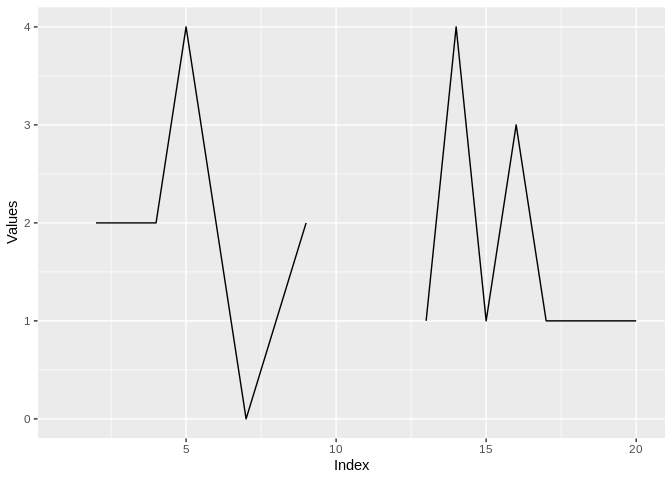
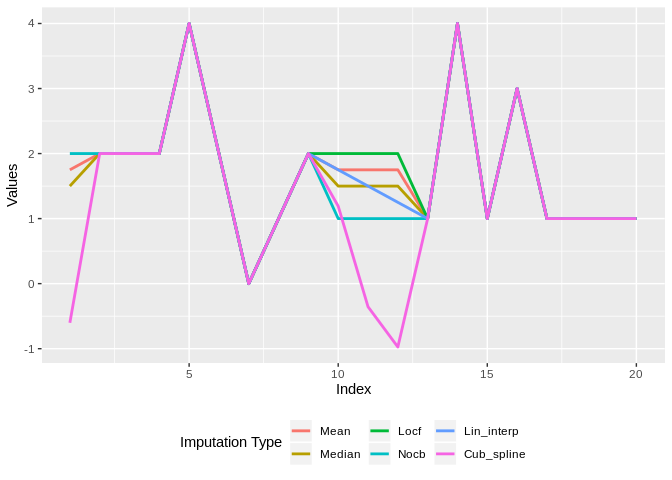

DDMEutils - Repository of useful functions for daily analysis and R programming
===============================================================================

1 `insp_outlier()`
------------------

Written by Gabriel Motta for outlier detection in time series, based on `anomalize` package. S3 methods are defined for `ts` and `data.frame` objects.

### Unidimensional time series

Undated object `x`:


The function call results in a `data.table` object. If `x` has no explicit dates, a default date sequence is created.

``` r
x_modif <- insp_outlier(as.ts(x))
x_modif[49:55]
```

    ##          DATE SERIES IMPUTED_SERIES OUTLIER_FLAG
    ## 1: 2018-12-17      9              9            0
    ## 2: 2018-12-18    -10              9            1
    ## 3: 2018-12-19     13             13            0
    ## 4: 2018-12-20     16             16            0
    ## 5: 2018-12-21      9              9            0
    ## 6: 2018-12-22     11             11            0
    ## 7: 2018-12-23     10             10            0

``` r
x_modif %>% 
  melt(id = "DATE", measure = patterns("SERIES")) %>% 
  dplyr::mutate(variable = factor(variable, labels = c("Original","Imputed"))) %>% {.[]} %>% 
  ggplot(aes(DATE,value,color = variable)) +
  geom_line() +
  labs(x = "Index", y = "Values", color = "") + 
  theme(legend.position = "bottom")
```


### Multiple time series

When working with multiple time series, one has to pay attention to two additional arguments: `margin` and `idcol, dtcol`.

-   If the series are arranged by rows, then set `margin = 1` and `idcol = <integer specifying index column>`. If there is no index column, then set `idcol = 0` or `idcol = NULL` (default);
-   If framed by columns, then set `margin = 2` and `dtcol = <integer specifying a date column>`. Likewise, `dtcol = 0` or `dtcol = NULL` if there is not an explicit date column.

#### Time series framed in rows

Example:

``` r
d1[,1:10]
```

    ##    ID       V1        V2       V3       V4       V5       V6       V7
    ## 1:  1 6.000000 10.000000 11.00000 7.000000 11.00000 8.000000 8.000000
    ## 2:  2 6.244618  9.415799 11.15879 4.281843 11.05028 6.112653 7.382401
    ##          V8       V9
    ## 1: 8.000000 7.000000
    ## 2: 6.722458 4.854605

``` r
# 'Wide' output format
insp_outlier(d1, margin = 1, idcol = 1) %>% 
  dplyr::sample_n(10) %>% 
  {.[order(ID, PERIOD)]}
```

    ##     ID PERIOD    SERIES IMPUTED_SERIES OUTLIER_FLAG
    ##  1:  1    V30 65.000000      14.000000            1
    ##  2:  1    V33 14.000000      14.000000            0
    ##  3:  1    V45  7.000000       7.000000            0
    ##  4:  1     V8  8.000000       8.000000            0
    ##  5:  1    V98  9.000000       9.000000            0
    ##  6:  2    V21 10.781461      10.781461            0
    ##  7:  2    V58  9.008439       9.008439            0
    ##  8:  2    V60 10.596816      10.596816            0
    ##  9:  2    V66 10.179573      10.179573            0
    ## 10:  2    V91  9.785419       9.785419            0

``` r
# 'Long' output format
insp_outlier(d1, margin = 1, out_format = "long") %>% 
  dplyr::sample_n(10) %>% 
  {.[order(ID, PERIOD)]}
```

    ##     ID PERIOD OUTLIER_FLAG IMPUTED     VALUE
    ##  1:  1    V23            0       0  8.000000
    ##  2:  1    V41            0       1 15.000000
    ##  3:  1    V44            0       1  9.000000
    ##  4:  1    V72            0       1  8.000000
    ##  5:  1    V82            0       0 16.000000
    ##  6:  1    V96            0       0  9.000000
    ##  7:  2    V13            0       1 13.015939
    ##  8:  2    V42            0       1 11.140025
    ##  9:  2    V44            0       1  7.086713
    ## 10:  2    V97            0       1  7.004491

#### Time series framed in cols

Example:

``` r
d2[1:5]
```

    ##          DATE SERIES1 SERIES2
    ## 1: 2018-01-01       6 -0.8488
    ## 2: 2018-01-02      10 -0.0055
    ## 3: 2018-01-03      11 -0.1260
    ## 4: 2018-01-04       7 -0.9942
    ## 5: 2018-01-05      11 -1.5702

``` r
# 'Wide' output format
insp_outlier(d2, margin = 2, dtcol = 1) %>% head()
```

    ##          DATE SERIES1 IMPUTED_SERIES1 OUTLIER_FLAG_SERIES1 SERIES2
    ## 1: 2018-01-01       6               6                    0 -0.8488
    ## 2: 2018-01-02      10              10                    0 -0.0055
    ## 3: 2018-01-03      11              11                    0 -0.1260
    ## 4: 2018-01-04       7               7                    0 -0.9942
    ## 5: 2018-01-05      11              11                    0 -1.5702
    ## 6: 2018-01-06       8               8                    0  0.9806
    ##    IMPUTED_SERIES2 OUTLIER_FLAG_SERIES2
    ## 1:         -0.8488                    0
    ## 2:         -0.0055                    0
    ## 3:         -0.1260                    0
    ## 4:         -0.9942                    0
    ## 5:         -1.5702                    0
    ## 6:          0.9806                    0

``` r
# 'Long' output format
insp_outlier(d2, margin = 2, dtcol = 1, out_format = "long") %>% 
  dplyr::sample_n(10) %>% 
  {.[order(SERIES, DATE)]}
```

    ##           DATE  SERIES OUTLIER_FLAG IMPUTED   VALUE
    ##  1: 2018-01-24 SERIES1            0       0 10.0000
    ##  2: 2018-02-23 SERIES1            0       1 11.0000
    ##  3: 2018-03-01 SERIES1            0       1 10.0000
    ##  4: 2018-03-07 SERIES1            0       1 11.0000
    ##  5: 2018-03-21 SERIES1            0       0 11.0000
    ##  6: 2018-01-17 SERIES2            0       0  2.8654
    ##  7: 2018-01-20 SERIES2            0       1  0.4729
    ##  8: 2018-01-22 SERIES2            0       1  0.0019
    ##  9: 2018-01-28 SERIES2            0       1 -1.1796
    ## 10: 2018-03-06 SERIES2            0       0 -0.8072

2 `insp_seasonality()`
----------------------

Written by Gabriel Motta for getting seasonality of time series, based on `forecast` package. S3 methods are defined for `ts` and `data.frame` objects.

Options for `data.frame`: (check `args(insp_outlier.data.frame)` for defaults)

-   `trend` T/F - if time series have trend;
-   `margin`
    -   `margin = 1` for series framed row-wise. In this case, specify as well an integer to an index column on `idcol`;
    -   `margin = 2` for series framed col-wise. Specify an integer to an date column on `dtcol`;
-   `periodicity` of the series

### Example for `airquality` dataset:

``` r
data <- airquality %>% as.data.table()
head(data)
```

    ##    Ozone Solar.R Wind Temp Month Day
    ## 1:    41     190  7.4   67     5   1
    ## 2:    36     118  8.0   72     5   2
    ## 3:    12     149 12.6   74     5   3
    ## 4:    18     313 11.5   62     5   4
    ## 5:    NA      NA 14.3   56     5   5
    ## 6:    28      NA 14.9   66     5   6

``` r
setorder(data, Month, Day)

data[, .(Wind, Temp)] %>% 
  insp_seasonality(margin = 2, dtcol = 0, periodicity = 'day')
```

    ##      ID SEASONALITY
    ## 1: Wind         365
    ## 2: Temp         365

Considering we have daily observations and a total length no longer than a year for 'Wind' and 'Temp' variables, seasonality 365 means that no periods of seasonality were found.

3 Value replacements with `subs_any()` and `subs_na()`
------------------------------------------------------

### `subs_na()`

Replaces NA occurrences in variables of a table. The syntax is either on the form `subs_na(data, col_1 = "?", col_2 = 999)` or `subs_na(data, list(col_1 = "?", col_2 = 999))`, where '?' and 999 are examples of replacement values.

### Example with `airquality` dataset

``` r
data <- airquality %>% as.data.table()
head(data)
```

    ##    Ozone Solar.R Wind Temp Month Day
    ## 1:    41     190  7.4   67     5   1
    ## 2:    36     118  8.0   72     5   2
    ## 3:    12     149 12.6   74     5   3
    ## 4:    18     313 11.5   62     5   4
    ## 5:    NA      NA 14.3   56     5   5
    ## 6:    28      NA 14.9   66     5   6

``` r
data %>% 
  subs_na(Ozone = 999, Solar.R = 999)
```

    ##      Ozone Solar.R Wind Temp Month Day
    ##   1:    41     190  7.4   67     5   1
    ##   2:    36     118  8.0   72     5   2
    ##   3:    12     149 12.6   74     5   3
    ##   4:    18     313 11.5   62     5   4
    ##   5:   999     999 14.3   56     5   5
    ##  ---                                  
    ## 149:    30     193  6.9   70     9  26
    ## 150:   999     145 13.2   77     9  27
    ## 151:    14     191 14.3   75     9  28
    ## 152:    18     131  8.0   76     9  29
    ## 153:    20     223 11.5   68     9  30

Regular expressions for equal value replacement and multiple column matching are supported:

``` r
# Replaces NA by 999 at columns that contain '.' 
data %>% subs_na("\\." = 999)
```

    ##      Ozone Solar.R Wind Temp Month Day
    ##   1:    41     190  7.4   67     5   1
    ##   2:    36     118  8.0   72     5   2
    ##   3:    12     149 12.6   74     5   3
    ##   4:    18     313 11.5   62     5   4
    ##   5:    NA     999 14.3   56     5   5
    ##  ---                                  
    ## 149:    30     193  6.9   70     9  26
    ## 150:    NA     145 13.2   77     9  27
    ## 151:    14     191 14.3   75     9  28
    ## 152:    18     131  8.0   76     9  29
    ## 153:    20     223 11.5   68     9  30

### `subs_any()`

Replaces any `x` value for any `y` within `data.frame` variables. The syntax is `subs_any(data, col_1 = list(<value>, <input>), col_2 = list(<value>, <input>))`.

Just like `subs_na()`, refer to multiple columns with regular expressions is supported.

``` r
data %>% 
  subs_any("^M|^D" = list(5, 10000))
```

    ##      Ozone Solar.R Wind Temp Month   Day
    ##   1:    41     190  7.4   67 10000     1
    ##   2:    36     118  8.0   72 10000     2
    ##   3:    12     149 12.6   74 10000     3
    ##   4:    18     313 11.5   62 10000     4
    ##   5:    NA      NA 14.3   56 10000 10000
    ##  ---                                    
    ## 149:    30     193  6.9   70     9    26
    ## 150:    NA     145 13.2   77     9    27
    ## 151:    14     191 14.3   75     9    28
    ## 152:    18     131  8.0   76     9    29
    ## 153:    20     223 11.5   68     9    30

4 Cleaning text variables and column names with `clean()`
---------------------------------------------------------

Methods for cleaning headers and text variables within data.frame. For `factor` objects, cleans levels attribute. Default replacements are stored in exported list `.dict`, where names `rm` and `undln` stand for 'remove' and 'underline' actions.

``` r
.dict
```

    ## $rm
    ##  [1] "`" "^" "~" "×" "÷" "¡" "¢" "£" "¤" "¥" "¦" "§" "¨" "©" "ª" "«" "¬"
    ## [18] "­" "®" "¯" "±" "²" "³" "´" "µ" "¶" "·" "¸" "¹" "º" "»" "¼" "½" "¾"
    ## [35] "¿"
    ## 
    ## $undln
    ## [1] "/"   "\\." "-"   "\\s" "\\(" "\\)"
    ## 
    ## $a
    ## [1] "à" "á" "â" "ã" "ä" "å"
    ## 
    ## $A
    ## [1] "À" "Á" "Â" "Ã" "Ä" "Å"
    ## 
    ## $c
    ## [1] "ç"
    ## 
    ## $C
    ## [1] "Ç"
    ## 
    ## $e
    ## [1] "è" "é" "ê" "ë"
    ## 
    ## $E
    ## [1] "È" "É" "Ê" "Ë"
    ## 
    ## $i
    ## [1] "ì" "í" "î" "ï"
    ## 
    ## $I
    ## [1] "Ì" "Í" "Î" "Ï"
    ## 
    ## $o
    ## [1] "ò" "ó" "ô" "õ" "ö" "ø"
    ## 
    ## $O
    ## [1] "Ò" "Ó" "Ô" "Õ" "Ö" "Ø"
    ## 
    ## $u
    ## [1] "ù" "ú" "û" "ü"
    ## 
    ## $U
    ## [1] "Ù" "Ú" "Û" "Ü"

``` r
to_clean <- c('Header with Nº of meas./hour(in measurement unit)', 
              '\u00c0rtificial p\u00fcnctuat\u00ead attribute')
to_clean
```

    ## [1] "Header with Nº of meas./hour(in measurement unit)"
    ## [2] "Àrtificial pünctuatêd attribute"

``` r
# S3 method for char 
clean(to_clean)
```

    ## [1] "Header_with_N_of_meas_hour_in_measurement_unit"
    ## [2] "Artificial_punctuated_attribute"

Additional arguments:

-   `keep` - vector of chars to remain unchanged;
-   `add_repl` - named vector of additional replacements desired.

``` r
clean(to_clean, keep ='º')
```

    ## [1] "Header_with_Nº_of_meas_hour_in_measurement_unit"
    ## [2] "Artificial_punctuated_attribute"

``` r
clean(to_clean, add_repl = c('H' = 'HHH'))
```

    ## [1] "HHHeader_with_N_of_meas_hour_in_measurement_unit"
    ## [2] "Artificial_punctuated_attribute"

For `data.frame`, further logical options are:

-   `col_names` - T/F for changes in table header;
-   `vars` - T/F for changes in table variables;
-   `byref` - T/F if replacements are made by reference in the table.

``` r
df_to_clean <- data.table(
  '"quoted name"' = 1,
  'text' = LETTERS[1:5] %>% stringr::str_replace_all( c('C'='Ç', 'A' = '"An extract from a book"'))
)

df_to_clean
```

    ##    "quoted name"                     text
    ## 1:             1 "An extract from a book"
    ## 2:             1                        B
    ## 3:             1                        Ç
    ## 4:             1                        D
    ## 5:             1                        E

``` r
# default: col_names = T, vars = F
df_to_clean %>% 
  clean(add_repl = c('"' = '')) %>% 
  clean(vars = T, col_names = F, keep = '\\s')
```

    ##    quoted_name                     text
    ## 1:           1 "An extract from a book"
    ## 2:           1                        B
    ## 3:           1                        C
    ## 4:           1                        D
    ## 5:           1                        E

5 Helpers for dealing with NA: `na_prop()` and `na_input()`
-----------------------------------------------------------

### `na_prop()`

Check total and proportion of missing values by `data.frame` variables.

``` r
# Default print
data %>% na_prop()
```

    ##    VARIABLE N_MISSING N_TOTAL    NA_FREQ
    ## 1:    Ozone        37     153 0.24183007
    ## 2:  Solar.R         7     153 0.04575163
    ## 3:     Wind         0     153 0.00000000
    ## 4:     Temp         0     153 0.00000000
    ## 5:    Month         0     153 0.00000000
    ## 6:      Day         0     153 0.00000000

``` r
# Restricted. Useful to retrieve variables that present more than min_prop of NA.   
data %>% na_prop(min_prop = 0.1)
```

    ##    VARIABLE N_MISSING N_TOTAL   NA_FREQ
    ## 1:    Ozone        37     153 0.2418301

### `na_input()`

Numerical imputation of vectors. Supported types:

-   Aggregating functions: adjustable-window mean or median;
-   Linear interpolation;
-   Cubic spline interpolation;
-   LOCF (Last Observation Carried Forward);
-   NOCB (Next Observation Carried Backward).

Graphical example:

``` r
set.seed(1234)
x <- rpois(20, 2); x[c(1,10,11,12)] <- NA 
qplot(seq_along(x), x, geom = "line", xlab = "Index", ylab = "Values")
```



``` r
dt <- data.table(Index = seq_along(x), x)
for(type in c('mean','median','locf','nocb','lin_interp','cub_spline')) {
  dt[, stringr::str_to_title(type) := na_input(x, how = type)]
} 
dt[, -'x'] %>% 
  melt(id = 'Index') %>% 
  ggplot(aes(Index, value, color = variable)) +
  geom_line(size = 1) +
  labs(y = 'Values', color = 'Imputation Type') +
  theme(legend.position = 'bottom')
```



Changing `window` parameter:

``` r
x <- c(NA, 10, 9, 8, 7, NA, NA, 100, 50)

# Controling window size
na_input(x, how = 'mean') # window default = Inf
```

    ## [1]  30.66667  10.00000   9.00000   8.00000   7.00000  30.66667  30.66667
    ## [8] 100.00000  50.00000

``` r
na_input(x, how = 'median', window = 3)
```

    ## [1]   9  10   9   8   7   9  29 100  50
