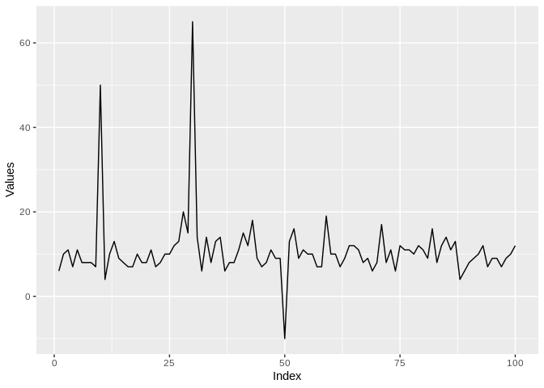

DDME - Repositório de funções do R úteis para o dia a dia
=========================================================

1 `insp_outlier()`
------------------

Função base criada por Gabriel Motta, útil para detecção de outliers em séries temporais com base no pacote `anomalize`. As opções de uso são:

-   Atômicos:
    -   vetor com inteiros ou numéricos
    -   objeto ts
-   Tabelas:
    -   data.table
    -   tbl\_df
    -   data.frame

### Exemplo série unidimensional

Vetor sem data guardado em `x`:



O resultado da chamada é um objeto `data.table`. Note que a coluna `DATA` é criada arbitrariamente e nem faz sentido, já que o objeto inicial não possui referências temporais.

``` r
x_alterado <- insp_outlier(as.ts(x))
x_alterado[49:55]
```

    ##        DATA SERIE SERIE_IMPUTADA FLAG_OUTLIER
    ## 1: 49-01-01     8              8            0
    ## 2: 50-01-01   -10              9            1
    ## 3: 51-01-01    11             11            0
    ## 4: 52-01-01     9              9            0
    ## 5: 53-01-01    12             12            0
    ## 6: 54-01-01     8              8            0
    ## 7: 55-01-01    17             17            0

``` r
x_alterado %>% 
  melt(id = "DATA", measure = patterns("SERIE")) %>% 
  dplyr::mutate(variable = factor(variable, labels = c("Original","Imputada"))) %>% {.[]} %>% 
  ggplot(aes(DATA,value,color = variable)) +
  geom_line() +
  labs(x = "Índice", y = "Valores", color = "") + 
  theme(legend.position = "bottom")
```


### Múltiplas séries

O sentido das séries na tabela que estiver trabalhando pode ser por linhas ou colunas, e essencialmente este é o único cuidado que se deve ter para a chamada da função. O argumento `sentido` deve ser definido como **1 para linhas** ou **2 para colunas**.

#### Séries nas linhas

Exemplo para tabelas com séries nas linhas:

``` r
d1[,1:10]
```

    ##    ID     V1       V2       V3       V4      V5       V6       V7       V8
    ## 1:  1 4.0000 11.00000 8.000000 8.000000 9.00000 13.00000  9.00000 11.00000
    ## 2:  2 2.9536 11.16443 7.447412 7.280833 8.57448 12.42751 10.40168 10.74901
    ##          V9
    ## 1: 16.00000
    ## 2: 14.82211

``` r
# Formato de saída "wide"
insp_outlier(d1, sentido = 1) %>% 
  dplyr::sample_n(10) %>% 
  {.[order(ID,PERIODO)]}
```

    ##     ID PERIODO     SERIE SERIE_IMPUTADA FLAG_OUTLIER
    ##  1:  1     V13 13.000000      13.000000            0
    ##  2:  1     V19  9.000000       9.000000            0
    ##  3:  1     V34 10.000000      10.000000            0
    ##  4:  1     V73  7.000000       7.000000            0
    ##  5:  1     V84  5.000000       5.000000            0
    ##  6:  2     V15  9.357883       9.357883            0
    ##  7:  2     V43 11.851474      11.851474            0
    ##  8:  2     V92  8.533175       8.533175            0
    ##  9:  2     V95  9.674963       9.674963            0
    ## 10:  2     V99 11.938894      11.938894            0

``` r
# Formato de saída "long"
insp_outlier(d1, sentido = 1, out_format = "long") %>% 
  dplyr::sample_n(10) %>% 
  {.[order(ID,PERIODO)]}
```

    ##     ID PERIODO FLAG_OUTLIER IMPUTADA     VALOR
    ##  1:  1     V15            0        0 11.000000
    ##  2:  1     V93            0        1  5.000000
    ##  3:  1     V95            0        0 10.000000
    ##  4:  2     V38            0        1  9.482080
    ##  5:  2     V43            0        0 11.851474
    ##  6:  2      V5            0        1  8.574480
    ##  7:  2      V6            0        1 12.427514
    ##  8:  2     V65            0        1  8.882865
    ##  9:  2     V73            0        1  6.786626
    ## 10:  2     V95            0        1  9.674963

#### Séries nas colunas

Exemplo para tableas com séries nas colunas:

``` r
d2[1:5]
```

    ##          DATA SERIE1  SERIE2
    ## 1: 2018-01-01      4 -2.1965
    ## 2: 2018-01-02     11  1.0265
    ## 3: 2018-01-03      8  0.9019
    ## 4: 2018-01-04      8  4.7961
    ## 5: 2018-01-05      9 -0.5567

``` r
# Formato de saída "wide"
insp_outlier(d2, sentido = 2) %>% head()
```

    ##          DATA SERIE1 SERIE1_IMPUTADA SERIE1_FLAG_OUTLIER  SERIE2
    ## 1: 2018-01-01      4               4                   0 -2.1965
    ## 2: 2018-01-02     11              11                   0  1.0265
    ## 3: 2018-01-03      8               8                   0  0.9019
    ## 4: 2018-01-04      8               8                   0  4.7961
    ## 5: 2018-01-05      9               9                   0 -0.5567
    ## 6: 2018-01-06     13              13                   0 -5.3792
    ##    SERIE2_IMPUTADA SERIE2_FLAG_OUTLIER
    ## 1:         -2.1965                   0
    ## 2:          1.0265                   0
    ## 3:          0.9019                   0
    ## 4:         -0.5567                   1
    ## 5:         -0.5567                   0
    ## 6:         -0.2819                   1

``` r
# Formato de saída "long"
insp_outlier(d2, sentido = 2, out_format = "long") %>% 
  dplyr::sample_n(10) %>% 
  {.[order(SERIE,DATA)]}
```

    ##           DATA  SERIE FLAG_OUTLIER IMPUTADA   VALOR
    ##  1: 2018-01-11 SERIE1            0        1 12.0000
    ##  2: 2018-02-01 SERIE1            0        1 17.0000
    ##  3: 2018-01-11 SERIE2            0        1  0.1078
    ##  4: 2018-01-26 SERIE2            0        1 -1.1355
    ##  5: 2018-01-31 SERIE2            1        0  3.7590
    ##  6: 2018-02-11 SERIE2            0        0  0.0671
    ##  7: 2018-02-15 SERIE2            0        1 -1.1553
    ##  8: 2018-02-20 SERIE2            1        0 -6.1171
    ##  9: 2018-03-09 SERIE2            1        0  9.6009
    ## 10: 2018-04-07 SERIE2            0        0 -0.1103

2 `na_prop()`
-------------

Função para checar proporção de valores faltantes num `data.table` com variáveis nas colunas.

### Exemplo para banco de dados `airquality`

``` r
dados <- airquality %>% as.data.table()
head(dados)
```

    ##    Ozone Solar.R Wind Temp Month Day
    ## 1:    41     190  7.4   67     5   1
    ## 2:    36     118  8.0   72     5   2
    ## 3:    12     149 12.6   74     5   3
    ## 4:    18     313 11.5   62     5   4
    ## 5:    NA      NA 14.3   56     5   5
    ## 6:    28      NA 14.9   66     5   6

``` r
# Geral
dados %>% na_prop()
```

    ##    VARIAVEL N_MISSING N_TOTAL PROPORCAO_NA
    ## 1:    Ozone        37     153   0.24183007
    ## 2:  Solar.R         7     153   0.04575163
    ## 3:     Wind         0     153   0.00000000
    ## 4:     Temp         0     153   0.00000000
    ## 5:    Month         0     153   0.00000000
    ## 6:      Day         0     153   0.00000000

``` r
# Restringindo proporcao
dados %>% na_prop(corte = 0.1)
```

    ##    VARIAVEL N_MISSING N_TOTAL PROPORCAO_NA
    ## 1:    Ozone        37     153    0.2418301

3 Substituição de valores com `subs_any()` e `subs_na()`
--------------------------------------------------------

### `subs_na()`

Função para substituição de NA em diversas variáveis de uma tabela. Os valores a substituir são especificados pelo nome das colunas na forma `subs_na(dados, col_1 = "?", col_2 = 999)` ou `subs_na(dados, list(col_1 = "?", col_2 = 999))`.

``` r
dados %>% 
  subs_na(Ozone = 999, Solar.R = 999)
```

    ##      Ozone Solar.R Wind Temp Month Day
    ##   1:    41     190  7.4   67     5   1
    ##   2:    36     118  8.0   72     5   2
    ##   3:    12     149 12.6   74     5   3
    ##   4:    18     313 11.5   62     5   4
    ##   5:   999     999 14.3   56     5   5
    ##  ---                                  
    ## 149:    30     193  6.9   70     9  26
    ## 150:   999     145 13.2   77     9  27
    ## 151:    14     191 14.3   75     9  28
    ## 152:    18     131  8.0   76     9  29
    ## 153:    20     223 11.5   68     9  30

É possível também usar expressões regulares para substituição em múltiplas colunas por valor comum:

``` r
# Substitui NA por 999 nas colunas que contém "." no nome.
dados %>% subs_na("\\." = 999)
```

    ##      Ozone Solar.R Wind Temp Month Day
    ##   1:    41     190  7.4   67     5   1
    ##   2:    36     118  8.0   72     5   2
    ##   3:    12     149 12.6   74     5   3
    ##   4:    18     313 11.5   62     5   4
    ##   5:    NA     999 14.3   56     5   5
    ##  ---                                  
    ## 149:    30     193  6.9   70     9  26
    ## 150:    NA     145 13.2   77     9  27
    ## 151:    14     191 14.3   75     9  28
    ## 152:    18     131  8.0   76     9  29
    ## 153:    20     223 11.5   68     9  30

### `subs_any()`

Substituição de qualquer valor `x` para qualquer valor `y` dentro de variáveis de tabela. A sintaxe se torna `subs_any(dados, col_1 = list(<valor>, <input>), col_2 = list(<valor>, <input>))`. Como em `subs_na()`, é possível referenciar mudanças para múltiplas colunas por expressão regular.

``` r
dados %>% 
  subs_any(Ozone = list(41, 10000), "\\." = list(190, 10000))
```

    ##      Ozone Solar.R Wind Temp Month Day
    ##   1: 10000   10000  7.4   67     5   1
    ##   2:    36     118  8.0   72     5   2
    ##   3:    12     149 12.6   74     5   3
    ##   4:    18     313 11.5   62     5   4
    ##   5:    NA      NA 14.3   56     5   5
    ##  ---                                  
    ## 149:    30     193  6.9   70     9  26
    ## 150:    NA     145 13.2   77     9  27
    ## 151:    14     191 14.3   75     9  28
    ## 152:    18     131  8.0   76     9  29
    ## 153:    20     223 11.5   68     9  30
