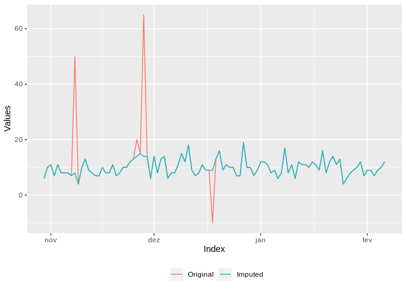

DDME - Repositório de funções do R úteis para o dia a dia
=========================================================

1) inspeciona\_outlier()
------------------------

Função base criada por Gabriel Motta, útil para detecção de outliers em séries temporais com base no pacote `anomalize`. As opções de uso são:

-   Atômicos:
    -   vetor com inteiros ou numéricos
    -   objeto ts
-   Tabelas:
    -   data.table
    -   tbl\_df
    -   data.frame

### Exemplo série unidimensional

Vetor sem data guardado em `x`:


O resultado da chamada é um objeto `data.table`. Note que a coluna `DATA` é criada arbitrariamente e nem faz sentido, já que o objeto inicial não possui referências temporais.

``` r
x_alterado <- inspeciona_outlier(x)
x_alterado[49:55]
```

    ##        DATA SERIE SERIE_IMPUTADA FLAG_OUTLIER
    ## 1: 49-01-01    10             10            0
    ## 2: 50-01-01   -10             10            1
    ## 3: 51-01-01     9              9            0
    ## 4: 52-01-01    11             11            0
    ## 5: 53-01-01     8              8            0
    ## 6: 54-01-01    23             10            1
    ## 7: 55-01-01    10             10            0

``` r
x_alterado %>% 
  melt(id = "DATA", measure = patterns("SERIE")) %>% 
  mutate(variable = factor(variable, labels = c("Original","Imputada"))) %>% {.[]} %>% 
  ggplot(aes(DATA,value,color = variable)) +
  geom_line() +
  labs(x = "Índice", y = "Valores", color = "") + 
  theme(legend.position = "bottom")
```



### Múltiplas séries

O sentido das séries na tabela que estiver trabalhando pode ser por linhas ou colunas, e essencialmente este é o único cuidado que se deve ter para a chamada da função. O argumento `sentido` deve ser definido como **1 para linhas** ou **2 para colunas**.

#### Séries nas linhas

Exemplo para tabelas com séries nas linhas:

``` r
d1[,1:10]
```

    ##    ID       V1       V2       V3       V4       V5       V6       V7
    ## 1:  1 12.00000 10.00000 8.000000 16.00000 14.00000 12.00000 5.000000
    ## 2:  2 12.71819 10.11892 8.877642 16.52357 13.41124 10.73746 5.627437
    ##          V8       V9
    ## 1: 5.000000 8.000000
    ## 2: 1.764888 6.856489

``` r
# Formato de saída "wide"
inspeciona_outlier(d1, sentido = 1) %>% 
  sample_n(10) %>% 
  {.[order(ID,PERIODO)]}
```

    ##     ID PERIODO    SERIE SERIE_IMPUTADA FLAG_OUTLIER
    ##  1:  1     V10 50.00000        7.00000            1
    ##  2:  1     V24  5.00000        5.00000            0
    ##  3:  1      V3  8.00000        8.00000            0
    ##  4:  1     V37  7.00000        7.00000            0
    ##  5:  1      V5 14.00000       14.00000            0
    ##  6:  1     V83 10.00000       10.00000            0
    ##  7:  2     V20 10.52552       10.52552            0
    ##  8:  2     V58 10.83296       10.83296            0
    ##  9:  2     V65 12.15562       12.15562            0
    ## 10:  2     V69 16.08907       16.08907            0

``` r
# Formato de saída "long"
inspeciona_outlier(d1, sentido = 1, out_format = "long") %>% 
  sample_n(10) %>% 
  {.[order(ID,PERIODO)]}
```

    ##     ID PERIODO FLAG_OUTLIER IMPUTADA     VALOR
    ##  1:  1     V22            0        0  8.000000
    ##  2:  1     V37            0        1  7.000000
    ##  3:  1     V43            0        0 14.000000
    ##  4:  2     V12            0        1  4.676908
    ##  5:  2     V25            0        0 12.876093
    ##  6:  2     V33            0        1  7.989363
    ##  7:  2     V59            0        0 11.601699
    ##  8:  2     V72            0        0 13.878207
    ##  9:  2     V89            0        0  5.652552
    ## 10:  2     V96            0        0 10.199391

#### Séries nas colunas

Exemplo para tableas com séries nas colunas:

``` r
d2[1:5]
```

    ##          DATA SERIE1  SERIE2
    ## 1: 2018-01-01     12 -0.7555
    ## 2: 2018-01-02     10 -0.7849
    ## 3: 2018-01-03      8  0.9616
    ## 4: 2018-01-04     16 -0.5439
    ## 5: 2018-01-05     14  3.8544

``` r
# Formato de saída "wide"
inspeciona_outlier(d2, sentido = 2) %>% head()
```

    ##          DATA SERIE1 SERIE1_IMPUTADA SERIE1_FLAG_OUTLIER  SERIE2
    ## 1: 2018-01-01     12              12                   0 -0.7555
    ## 2: 2018-01-02     10              10                   0 -0.7849
    ## 3: 2018-01-03      8               8                   0  0.9616
    ## 4: 2018-01-04     16              16                   0 -0.5439
    ## 5: 2018-01-05     14              14                   0  3.8544
    ## 6: 2018-01-06     12              12                   0 -2.0618
    ##    SERIE2_IMPUTADA SERIE2_FLAG_OUTLIER
    ## 1:         -0.7555                   0
    ## 2:         -0.7849                   0
    ## 3:          0.9616                   0
    ## 4:         -0.5439                   0
    ## 5:          0.1824                   1
    ## 6:         -2.0618                   0

``` r
# Formato de saída "long"
inspeciona_outlier(d2, sentido = 2, out_format = "long") %>% 
  sample_n(10) %>% 
  {.[order(SERIE,DATA)]}
```

    ##           DATA  SERIE FLAG_OUTLIER IMPUTADA   VALOR
    ##  1: 2018-02-26 SERIE1            0        0  7.0000
    ##  2: 2018-03-03 SERIE1            0        0  8.0000
    ##  3: 2018-03-08 SERIE1            0        0 14.0000
    ##  4: 2018-04-01 SERIE1            0        1  8.0000
    ##  5: 2018-02-07 SERIE2            0        1  1.1527
    ##  6: 2018-02-08 SERIE2            0        0 -1.3863
    ##  7: 2018-02-22 SERIE2            0        0  1.5144
    ##  8: 2018-03-01 SERIE2            0        1  0.8308
    ##  9: 2018-03-19 SERIE2            0        1  0.5750
    ## 10: 2018-03-25 SERIE2            0        1 -1.0191

2) prop\_na()
-------------

Função para checar proporção de valores faltantes num `data.table` com variáveis nas colunas.

-   Outras possibilidades:
    -   Apresentar colunas com mais do que `corte` na proporção de NAs
    -   Retirar colunas com proporção de NAs maior do que `corte` se `drop = TRUE`

### Exemplo para banco de dados datasets::attenu

``` r
dados <- datasets::attenu %>% as.data.table()
head(dados)
```

    ##    event mag station dist accel
    ## 1:     1 7.0     117   12 0.359
    ## 2:     2 7.4    1083  148 0.014
    ## 3:     2 7.4    1095   42 0.196
    ## 4:     2 7.4     283   85 0.135
    ## 5:     2 7.4     135  107 0.062
    ## 6:     2 7.4     475  109 0.054

``` r
# Geral
dados %>% prop_na()
```

    ##    VARIAVEL N_MISSING N_TOTAL PROPORCAO_NA
    ## 1:  station        16     182   0.08791209
    ## 2:    event         0     182   0.00000000
    ## 3:      mag         0     182   0.00000000
    ## 4:     dist         0     182   0.00000000
    ## 5:    accel         0     182   0.00000000

``` r
# Restringindo proporcao
dados %>% prop_na(corte = 0.2)
```

    ## Empty data.table (0 rows) of 4 cols: VARIAVEL,N_MISSING,N_TOTAL,PROPORCAO_NA

Mudando base por referência:

``` r
dados %>% prop_na(corte = 0.05, drop = TRUE)
```

    ## Removendo as seguintes colunas:
    ## station

``` r
dados
```

    ##      event mag  dist accel
    ##   1:     1 7.0  12.0 0.359
    ##   2:     2 7.4 148.0 0.014
    ##   3:     2 7.4  42.0 0.196
    ##   4:     2 7.4  85.0 0.135
    ##   5:     2 7.4 107.0 0.062
    ##  ---                      
    ## 178:    23 5.3  46.1 0.070
    ## 179:    23 5.3  47.1 0.080
    ## 180:    23 5.3  47.7 0.033
    ## 181:    23 5.3  49.2 0.017
    ## 182:    23 5.3  53.1 0.022
